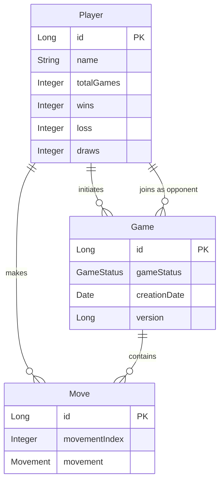

# Tic-Tac-Toe API

A Spring Boot 3 / H2 in-memory REST service that lets two human players—or one human and the built-in AI—play classic tic-tac-toe.  
The service is intentionally stateless, persist-first and small enough to run in <5 seconds, yet demonstrates a clean layered architecture (Controller → Service → Repository → JPA Entity) and full optimistic-locking support.

---

## Table of Contents
1. [Entity–Relationship Diagram](#entityrelationship-diagram)
2. [Technology Stack](#technology-stack)
3. [High-Level Architecture](#high-level-architecture)
4. [Database](#database)
5. [REST Endpoints & cURL Examples](#rest-endpoints--curl-examples)
6. [Typical Use-Case Scenarios](#typical-use-case-scenarios)
7. [Board Representation](#board-representation)
8. [Error Handling](#error-handling)
9. [Project Setup & Running Locally](#project-setup--running-locally)
10. [Future Improvements](#future-improvements)

---

## Entity–Relationship Diagram

The application has three main entities: Player, Game, and Move. Below is an ERD diagram showing their relationships:



- A Player can initiate multiple Games (as initiator)
- A Player can join multiple Games (as opponent)
- A Player can make multiple Moves
- A Game can contain multiple Moves
- A Game has one initiator Player and optionally one opponent Player
- A Move belongs to one Game and is made by one Player

## Technology Stack

This application is built using the following technologies:

- **Java 17**: The core programming language
- **Spring Boot 3**: Framework for creating stand-alone, production-grade Spring-based applications
- **Spring Data JPA**: Simplifies data access with the Java Persistence API
- **H2 Database**: In-memory database for development and testing
- **Lombok**: Library to reduce boilerplate code
- **Maven**: Dependency management and build tool
- **Jakarta Validation**: For input validation

## High-Level Architecture

The application follows a clean layered architecture:

1. **Controller Layer**: Handles HTTP requests and responses
   - PlayerController: Manages player registration and retrieval
   - GameController: Handles game creation, joining, and AI game management
   - MoveController: Processes game moves and retrieves game state

2. **Service Layer**: Contains business logic
   - PlayerService: Player registration and management
   - GameService: Game creation, joining, and AI game logic
   - MoveService: Move validation and game state evaluation

3. **Repository Layer**: Data access layer
   - PlayerRepository: CRUD operations for Player entity
   - GameRepository: CRUD operations for Game entity
   - MoveRepository: CRUD operations for Move entity

4. **Model Layer**: Domain entities
   - Player: Represents a player in the system
   - Game: Represents a tic-tac-toe game
   - Move: Represents a move made by a player in a game

5. **Utility Components**:
   - BoardEvaluator: Evaluates the game board to determine winners and draws
   - TicTacToeAiEngine: Implements the AI logic for computer opponents

## Database

The application uses an H2 in-memory database for data storage. The database is configured with the following properties:

- **URL**: `jdbc:h2:mem:TicTacToeDB`
- **Console**: Enabled at `/h2-console`
- **Username**: `username`
- **Password**: `password`

The database schema is automatically created based on the JPA entity definitions when the application starts. The following tables are created:

- `players`: Stores player information
- `games`: Stores game information
- `moves`: Stores move information

To access the H2 console:
1. Start the application
2. Navigate to `http://localhost:8080/h2-console`
3. Enter the connection details as specified above

## REST Endpoints & cURL Examples

The application exposes the following REST endpoints:

### Player Management

#### Register a Player
- **Endpoint**: `POST /players`
- **Description**: Registers a new player
- **Request Body**: Player name
- **Response**: Player details with ID

```bash
# Register a player
curl -X POST http://localhost:8080/players \
  -H "Content-Type: application/json" \
  -d '{"name": "John"}'
```

#### Get All Players
- **Endpoint**: `GET /players`
- **Description**: Retrieves all registered players
- **Response**: List of players

```bash
# Get all players
curl -X GET http://localhost:8080/players
```

### Game Management

#### Create a Game
- **Endpoint**: `POST /games`
- **Description**: Creates a new game with the specified player as initiator
- **Request Body**: Initiator player ID
- **Response**: Game details

```bash
# Create a game
curl -X POST http://localhost:8080/games \
  -H "Content-Type: application/json" \
  -d '{"initiatorId": 1}'
```

#### Create a Game vs AI
- **Endpoint**: `POST /games/ai`
- **Description**: Creates a new game against the AI
- **Request Body**: Human player ID
- **Query Parameter**: `playsFirst` (boolean, default: true) - Whether the human player plays first
- **Response**: Game details

```bash
# Create a game vs AI (human plays first)
curl -X POST http://localhost:8080/games/ai \
  -H "Content-Type: application/json" \
  -d '{"initiatorId": 1}'

# Create a game vs AI (AI plays first)
curl -X POST "http://localhost:8080/games/ai?playsFirst=false" \
  -H "Content-Type: application/json" \
  -d '{"initiatorId": 1}'
```

#### List Available Games
- **Endpoint**: `GET /games/available`
- **Description**: Lists all games waiting for an opponent
- **Response**: List of available games

```bash
# List available games
curl -X GET http://localhost:8080/games/available
```

#### Join a Game
- **Endpoint**: `POST /games/{id}/join`
- **Description**: Joins an existing game as the opponent
- **Path Parameter**: Game ID
- **Request Body**: Player ID
- **Response**: Updated game details

```bash
# Join a game
curl -X POST http://localhost:8080/games/1/join \
  -H "Content-Type: application/json" \
  -d '{"playerId": 2}'
```

#### Get Game State
- **Endpoint**: `GET /games/{id}`
- **Description**: Retrieves the current state of a game
- **Path Parameter**: Game ID
- **Response**: Game state including board, status, and winner (if any)

```bash
# Get game state
curl -X GET http://localhost:8080/games/1
```

### Move Management

#### Make a Move
- **Endpoint**: `POST /games/{gameId}/moves`
- **Description**: Makes a move in a game
- **Path Parameter**: Game ID
- **Request Body**: Player ID and movement index (0-8)
- **Response**: Updated game state

```bash
# Make a move
curl -X POST http://localhost:8080/games/1/moves \
  -H "Content-Type: application/json" \
  -d '{"playerId": 1, "movementIndex": 4}'
```

#### Make a Move vs AI
- **Endpoint**: `POST /games/ai/moves`
- **Description**: Makes a move in a game against the AI and gets the AI's response
- **Request Body**: Game ID, player ID, and movement index
- **Response**: Updated game state including the AI's move

```bash
# Make a move vs AI
curl -X POST http://localhost:8080/games/ai/moves \
  -H "Content-Type: application/json" \
  -d '{"gameId": 1, "playerId": 1, "movementIndex": 4}'
```

## Typical Use-Case Scenarios

### Two Human Players

1. Player 1 registers:
   ```bash
   curl -X POST http://localhost:8080/players -H "Content-Type: application/json" -d '{"name": "Player1"}'
   # Response: {"id": 1, "name": "Player1", ...}
   ```

2. Player 2 registers:
   ```bash
   curl -X POST http://localhost:8080/players -H "Content-Type: application/json" -d '{"name": "Player2"}'
   # Response: {"id": 2, "name": "Player2", ...}
   ```

3. Player 1 creates a game:
   ```bash
   curl -X POST http://localhost:8080/games -H "Content-Type: application/json" -d '{"initiatorId": 1}'
   # Response: {"id": 1, "status": "WAITING_FOR_OPPONENT", ...}
   ```

4. Player 2 joins the game:
   ```bash
   curl -X POST http://localhost:8080/games/1/join -H "Content-Type: application/json" -d '{"playerId": 2}'
   # Response: {"id": 1, "status": "PLAYER_X_TURN", ...}
   ```

5. Players take turns making moves:
   ```bash
   # Player 1 (X) makes a move
   curl -X POST http://localhost:8080/games/1/moves -H "Content-Type: application/json" -d '{"playerId": 1, "movementIndex": 0}'
   # Response: {"board": ["X", null, null, ...], "gameStatus": "PLAYER_O_TURN", ...}

   # Player 2 (O) makes a move
   curl -X POST http://localhost:8080/games/1/moves -H "Content-Type: application/json" -d '{"playerId": 2, "movementIndex": 4}'
   # Response: {"board": ["X", null, null, null, "O", ...], "gameStatus": "PLAYER_X_TURN", ...}
   ```

6. Game continues until someone wins or it's a draw:
   ```bash
   # Final state
   curl -X GET http://localhost:8080/games/1
   # Response: {"board": ["X", "X", "X", "O", "O", null, null, null, null], "gameStatus": "X_WON", "winner": "Player1"}
   ```

### Human vs AI

1. Player registers:
   ```bash
   curl -X POST http://localhost:8080/players -H "Content-Type: application/json" -d '{"name": "Human"}'
   # Response: {"id": 1, "name": "Human", ...}
   ```

2. Player creates a game vs AI:
   ```bash
   curl -X POST http://localhost:8080/games/ai -H "Content-Type: application/json" -d '{"initiatorId": 1}'
   # Response: {"id": 1, "status": "PLAYER_X_TURN", ...}
   ```

3. Player makes moves against the AI:
   ```bash
   # Human makes a move and AI responds
   curl -X POST http://localhost:8080/games/ai/moves -H "Content-Type: application/json" -d '{"gameId": 1, "playerId": 1, "movementIndex": 0}'
   # Response: {"board": ["X", null, null, null, "O", ...], "gameStatus": "PLAYER_X_TURN", "aiMoveIndex": 4}
   ```

4. Game continues until someone wins or it's a draw

## Board Representation

The tic-tac-toe board is represented as a 3x3 grid with cells numbered from 0 to 8:

```
 0 | 1 | 2 
-----------
 3 | 4 | 5 
-----------
 6 | 7 | 8 
```

In the API, the board is returned in two formats:

1. As a flat list of 9 elements (`board` field in responses), where each element can be:
   - `"X"` - Cell marked by player X
   - `"O"` - Cell marked by player O
   - `null` - Empty cell

2. As three formatted rows (`row1`, `row2`, `row3` fields in responses), for easier visualization:
   ```
   "X | O | X"
   "O | X | O"
   "X |   |  "
   ```

When making a move, you specify the cell index (0-8) in the `movementIndex` field of the request.

## Error Handling

The API uses standard HTTP status codes to indicate the success or failure of requests:

- **200 OK**: The request was successful
- **201 Created**: The resource was successfully created
- **400 Bad Request**: The request was invalid (e.g., invalid move index)
- **403 Forbidden**: The request was not allowed (e.g., player making a move out of turn)
- **404 Not Found**: The requested resource was not found (e.g., game or player not found)
- **409 Conflict**: The request could not be completed due to a conflict (e.g., cell already taken)

Error responses include a message explaining the error.

Common error scenarios:

- Trying to join a game that already has an opponent
- Trying to make a move when it's not your turn
- Trying to make a move in a cell that's already taken
- Trying to make a move in a game that's already finished
- Trying to create a new game when already in an active game

## Project Setup & Running Locally

### Prerequisites

- Java 17 or higher
- Maven 3.6 or higher

### Running the Application

1. Clone the repository:
   ```bash
   git clone https://github.com/yourusername/tictactoe.git
   cd tictactoe
   ```

2. Build the application:
   ```bash
   mvn clean package
   ```

3. Run the application:
   ```bash
   java -jar target/tictactoe-0.0.1-SNAPSHOT.jar
   ```

   Alternatively, you can use Maven to run the application:
   ```bash
   mvn spring-boot:run
   ```

4. The application will be available at `http://localhost:8080`

### Testing the Application

You can test the application using the cURL commands provided in the [REST Endpoints & cURL Examples](#rest-endpoints--curl-examples) section.

## Future Improvements

Potential enhancements for the application:

1. **Authentication and Authorization**:
   - Implement user authentication to secure the API
   - Add role-based access control

2. **Persistent Storage**:
   - Replace H2 in-memory database with a persistent database like PostgreSQL or MySQL

3. **Real-time Gameplay**:
   - Implement WebSocket support for real-time updates
   - Add notifications for game events

4. **Game History**:
   - Store and display game history for players
   - Implement replay functionality

5. **Enhanced AI**:
   - Implement difficulty levels for the AI
   - Add different AI strategies

6. **UI Client**:
   - Develop a web or mobile client for the API
   - Implement a responsive design for different devices

7. **Metrics and Analytics**:
   - Track player statistics
   - Generate reports on game outcomes

8. **Customizable Game Rules**:
   - Support different board sizes (4x4, 5x5)
   - Implement variants of tic-tac-toe with different winning conditions
